# School_District_Analysis

# Background

After running analysis on the Py City School district, evidence of academic dishonesty was reported. Specifically, reading and math grades for Thomas High School ninth graders appear to have been altered. We have been asked to remove the ninth grade scores and rerun the 
analysis. To do this we replaced the math and reading scores for Thomas High School with NaNs while keeping the rest of the data intact. We then repeated the school district analysis. This is a report to show how these changes affected the overall analysis.

# Deliverable 1: Replace ninth-grade reading and math scores

### The loc method is used to select all the reading and math scores from the ninth grade at Thomas High School:

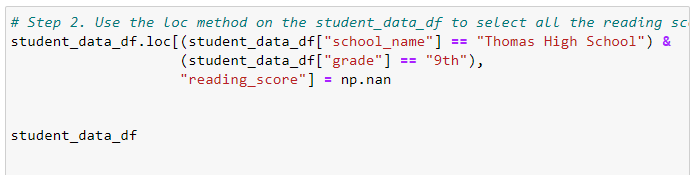

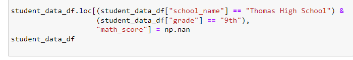 

### The reading and math scores for the ninth graders in Thomas High school are replaced with NaNs:

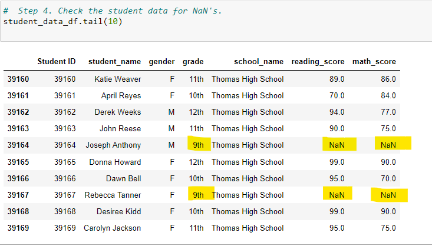

# Deliverable 2: Repeat the school district analysis

### The district summary:

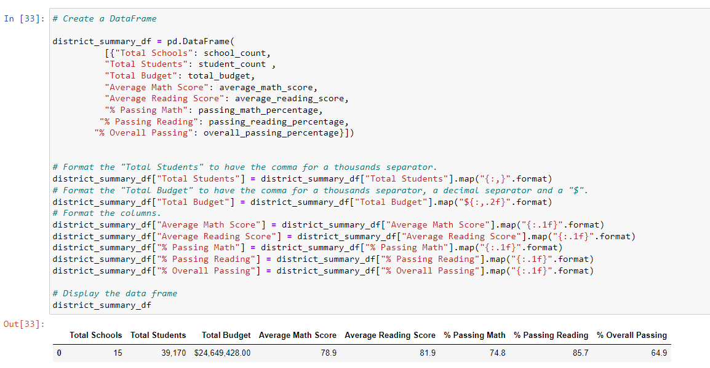

### The school summary:

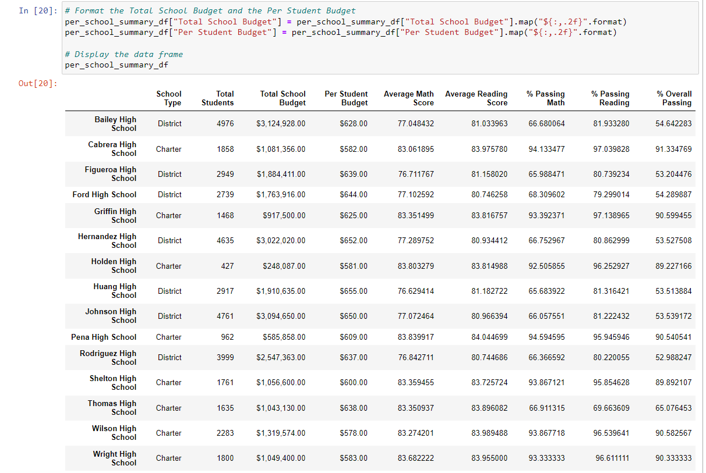

### The top 5 performing schools, based on the overall passing rate:

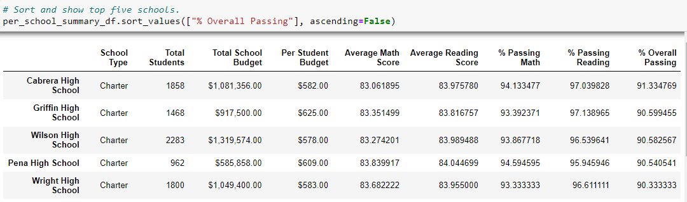

## The bottom 5 performing schools, based on the overall passing rate:

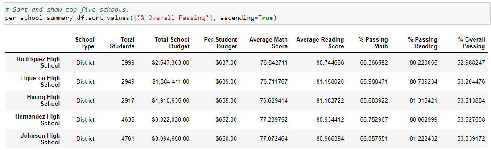

### The average math score for each grade level from each school:

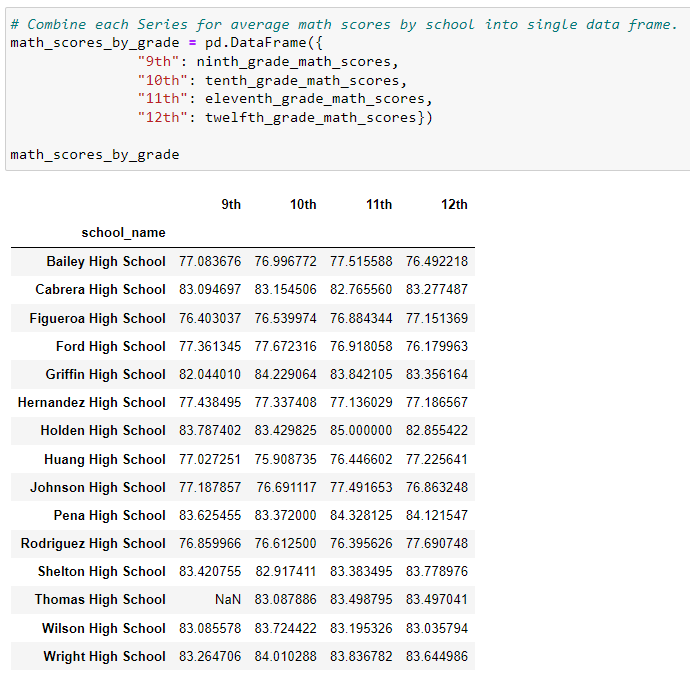

### The average reading score for each grade level from each school:

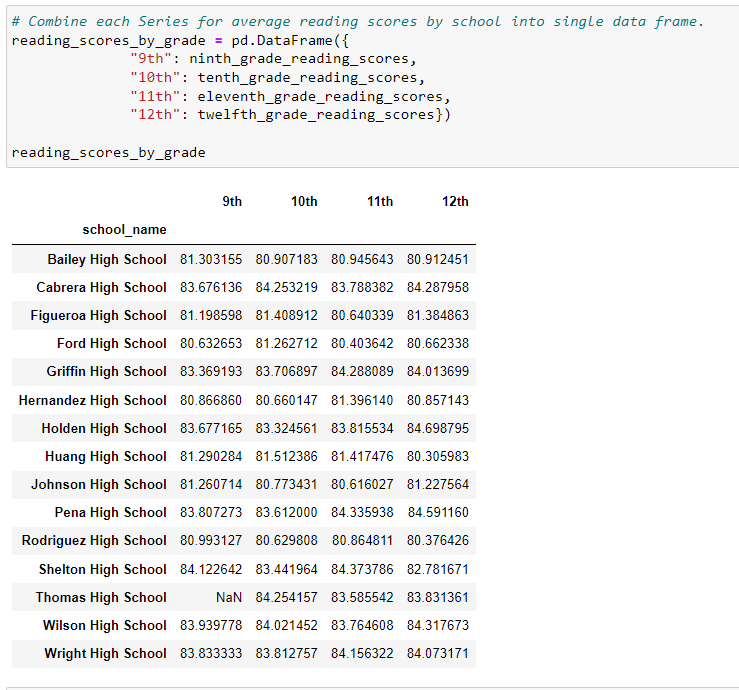

### The scores by school spending per student, by school size, and by school type:

# Deliverable 3: A written report for the school district analysis

The Py City School District Analysis was repeated, with Thomas High School math and reading scores replaced by NaNs.  The Thomas High School student count was also adjusted for the ninth graders that were removed.  The following differences in data were noted.

For Thomas High School, removing the ninth grade scores did not affect the math and reading averages. However, the removal did effect the percentage for passing math, reading and overall passing. 

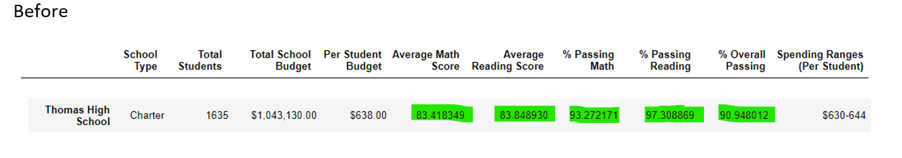

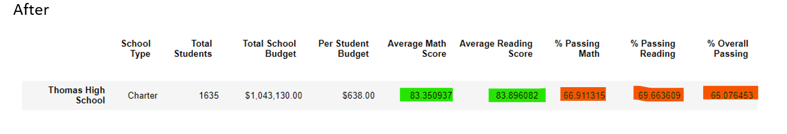

Although Thomas High School saw a dramatic decrease in the passing percentages, the removal of the ninth grade scores did not have a signigicant impact on the district percentages.

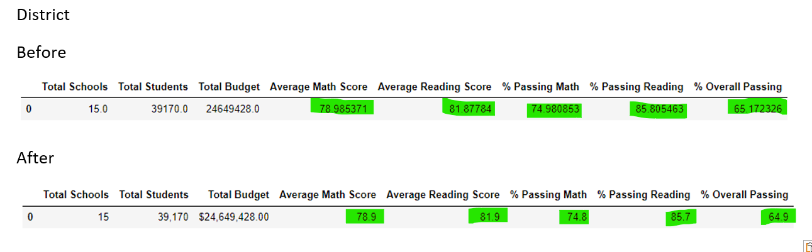

This reapeated analysisc can have a significant impact on future budgeting for Thomas High School.  The school may get extra monies, becasue it appears they need it to bring up overall percentage of passing scores. On the other hand, school adminsitrator and teacher evaluations or bonuses may be negatively affected. Also, since it affected overall passing paercenatages, it may not reflect a true reflection of how charter schools perform versus District.  

