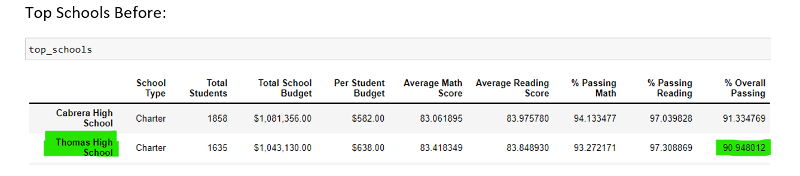
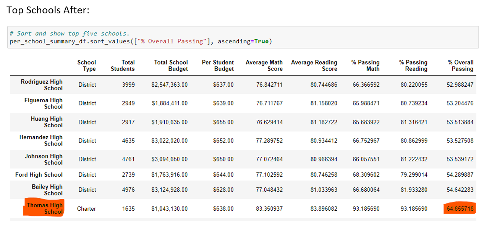
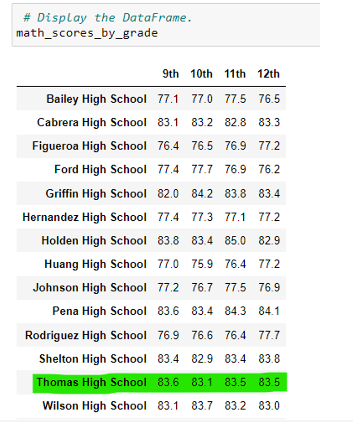
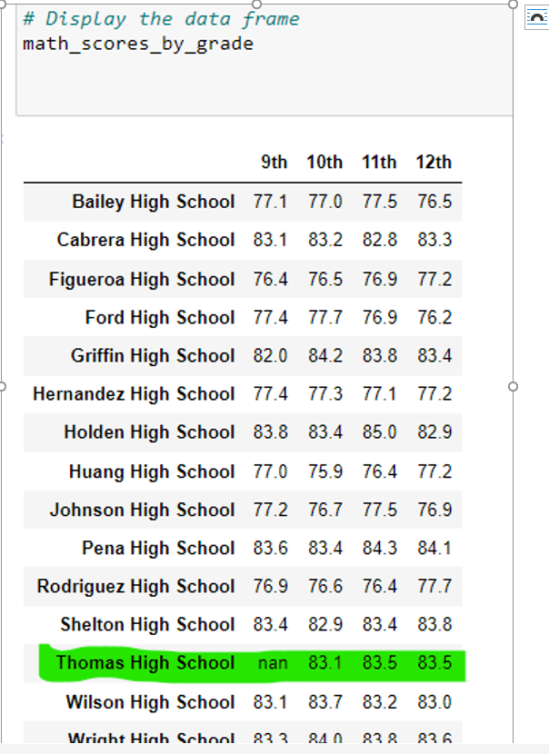
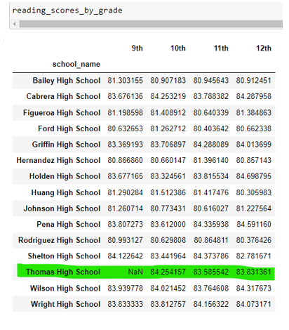
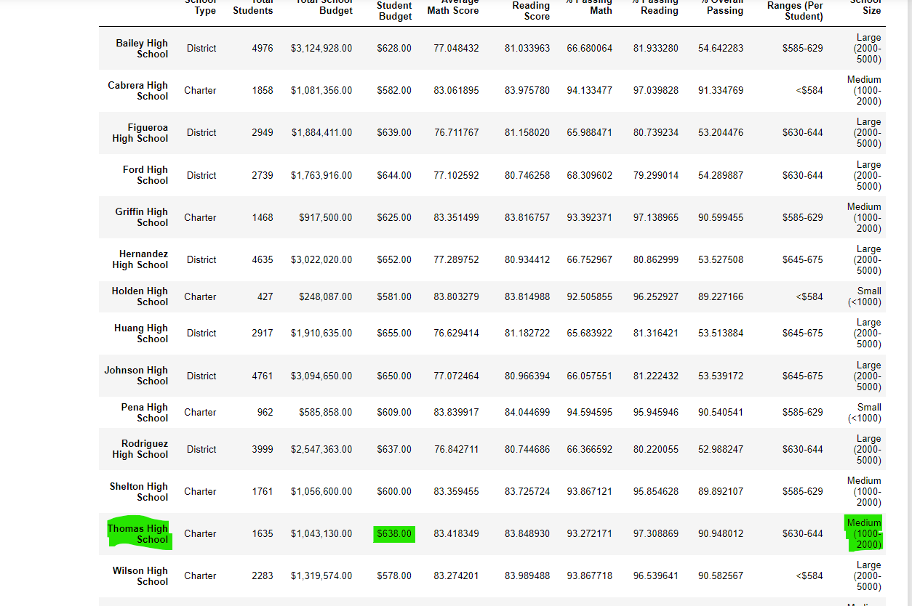
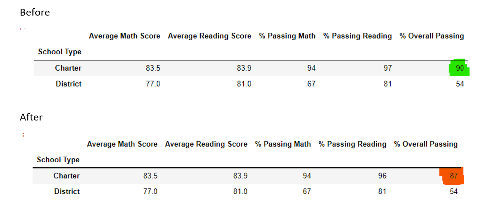

# School_District_Analysis

# Background

After running analysis on the Py City School district, evidence of academic dishonesty was reported. Specifically, reading and math grades for Thomas High School ninth graders appear to have been altered. We have been asked to remove the ninth grade scores and rerun the 
analysis. To do this we replaced the math and reading scores for Thomas High School with NaNs while keeping the rest of the data intact. We then repeated the school district analysis. This is a report to show how these changes affected the overall analysis.

# Deliverable 1: Replace ninth-grade reading and math scores

### The loc method is used to select all the reading and math scores from the ninth grade at Thomas High School:

 

### The reading and math scores for the ninth graders in Thomas High school are replaced with NaNs:

# Deliverable 2: Repeat the school district analysis

### The district summary:

### The school summary:

### The top 5 performing schools, based on the overall passing rate:

### The bottom 5 performing schools, based on the overall passing rate:

### The average math score for each grade level from each school:

### The average reading score for each grade level from each school:

### The scores by school spending per student, by school size, and by school type:

# Deliverable 3: School district analysis

## Overview of the school district analysis: Explain the purpose of this analysis.

After running analysis on the Py City School district, evidence of academic dishonesty was reported. Specifically, reading and math grades for Thomas High School ninth graders appear to have been altered. We have been asked to remove the ninth grade scores and rerun the 
analysis. To do this we replaced the math and reading scores for Thomas High School with NaNs while keeping the rest of the data intact. We then repeated the school district analysis. This is a report to show how these changes affected the overall analysis. 
The Py City School District Analysis was repeated, with Thomas High School math and reading scores replaced by NaNs.  The Thomas High School student count was also adjusted for the ninth graders that were removed.  The following aspects the data were noted.

## Results: 

### District Summary 
Although Thomas High School saw a dramatic decrease in the passing percentages, the removal of the ninth grade scores did have not a significant impact on the district percentages. Overal passing was 65% both pre and post, with the exception of a few tenths of a point.

### School Summary 
For Thomas High School, removing the ninth grade scores did not affect the math and reading averages. However, the removal did affect the percentage for passing math, reading and overall passing.  Passing percentages decreased from the 90s percentages down to the 60s percentages.
 

### School Rank 

Replacing the ninth graders’ math and reading scores affected Thomas High School’s performance relative to the other schools by decreasing the overall passing percentage.
Thomas High School went from being 2nd to 8th based on the overall passing percentage decrease.

### Ninth-grade scores:
Math and reading scrore were not affected, other than the lack of data for ninth graders at Thomas High School.

### Math Scores by Grade Before:

### Math Scores by Grade After:

### Reading Scores by Grade Before:

### Reading Scores by Grade After:

### Scores by school, spending, school size,school, type
Scores by school spending and size, were not affected by the change. However, charter school overall passing percentage dropped from 90 to 87.

### Scores by school, spending and school size Before:

### Scores by school, spending and school size After:

### School type:

## Summary:  
Four changes that were noted in the updated school district analysis after, reading and math scores for the ninth grade at Thomas High School have been replaced with NaNs, include the following:
 
 Percent passing math for Thoams High School decreased from 93.27 to 66.91.
 Percent passing reading for Thoams High School decreased from 97.3 to 66.63.
 Overall passing percentage for Thoams High School decreased from 90.94 to 66.07.
 Thomas High School rank compare to other schools decreased from 2nd place to 8th place.

This reapeated analysis can have a significant impact on future budgeting for Thomas High School.  The school may get extra monies, becasue it appears they need it to bring up overall percentage of passing scores. On the other hand, school adminsitrator and teacher evaluations or bonuses may be negatively affected. This also affected the presentation of charter school analysis, as the charter school overall passing percentage dropped from 90 to 87.  

