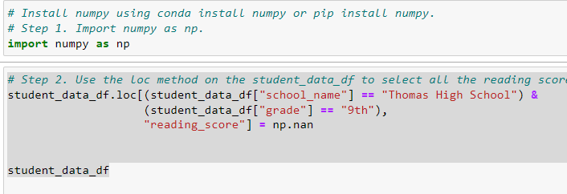

# School_District_Analysis

## Background

After running analysis on the Pyc City School district, evidence of academic dishonesty; specifically, reading and math grades for Thomas High School ninth graders appear to have been altered. We have been asked to remove the ninth grade scores and rerun the 
analysis. To do this we replaced the math and reading scores for Thomas High School with NaNs while keeping the rest of the data intact. We then repeated the school district analysis. This is a report to describe how these changes affected the overall analysis.

## Deliverable 1: Replace ninth-grade reading and math scores

The loc method is used to select all the reading and math scores from the ninth grade at Thomas High School. 

 

The reading and math scores for the ninth graders in Thomas High school are replaced with NaNs.

## Deliverable 2: Repeat the school district analysis
## Deliverable 3: A written report for the school district analysis
